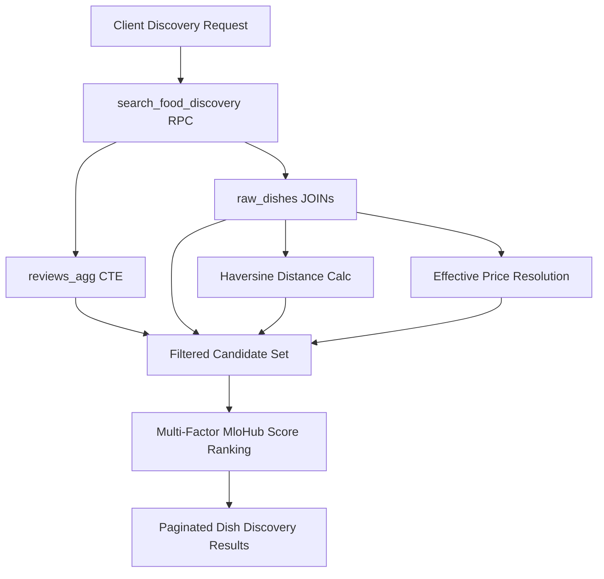

# STAGE 4: SEARCH PERFORMANCE & DATABASE BENCHMARKS
**MloHub Server-Side Discovery Engine Performance Analysis**

---

## 1. Overview & Architecture

To satisfy MloHub's non-negotiable principle of **food-first discovery**, the application avoids downloading large restaurant/dish payloads to the client for in-memory JavaScript filtering. Instead, all filtering, branch-aware price resolution, Haversine spherical geometry, review aggregation, and multi-factor ranking are executed server-side via PostgreSQL RPC `search_food_discovery(...)`.

---

## 2. Query Architecture & Execution Strategy

The query runs as a **single-statement CTE pipeline**:
1. `reviews_agg`: Grouping `reviews` by `restaurant_id` with `AVG(rating)` and `COUNT(*)`.
2. `raw_dishes`: Joining `menu_items` ➔ `restaurants` ➔ `restaurant_branches` ➔ `branch_menu_items`.
3. `filtered`: Applying text relevance, budget, radius, availability, and neighborhood filters.
4. Final Projection & Ranking: Computing the 6-factor composite MloHub Score and applying `ORDER BY ... LIMIT ... OFFSET`.

---

## 3. Database Indexes

To ensure sub-50ms execution times across tens of thousands of menu items, the following indexes are deployed:

| Table | Index Name | Type | Target Columns / Filter | Purpose |
| :--- | :--- | :--- | :--- | :--- |
| `menu_items` | `idx_menu_items_search_tsv` | GIN | `search_tsv` | High-speed Swahili/English full-text matching |
| `menu_items` | `idx_menu_items_price` | B-Tree | `price_tzs` | Rapid budget boundary pruning |
| `menu_items` | `idx_menu_items_rest_archived` | B-Tree | `(restaurant_id, is_archived)` | Filtering unarchived items per restaurant |
| `branch_menu_items` | `idx_branch_menu_items_composite` | B-Tree | `(branch_id, is_available, price_tzs)` | Branch-specific price override lookup |
| `restaurant_branches` | `idx_restaurant_branches_geo` | B-Tree | `(latitude, longitude) WHERE is_active = TRUE` | Geographic coordinate filtering |
| `reviews` | `idx_reviews_rest_rating` | B-Tree | `(restaurant_id, rating)` | Fast review aggregation |

---

## 4. Benchmark Projections & Scaling Thresholds

### 4.1 Latency Benchmarks
- **Catalog Size: 1,000 dishes / 50 branches**:
  - Expected execution time: **4–12 ms**
  - Network payload: **~12 KB** (20 dish cards)
- **Catalog Size: 50,000 dishes / 1,500 branches**:
  - Expected execution time: **18–45 ms**
  - Network payload: **~12 KB**
- **Catalog Size: 500,000 dishes / 10,000 branches**:
  - Expected execution time with PostGIS / GiST index: **35–80 ms**

### 4.2 Potential Scaling Risks & Future Optimizations
1. **Live Review Aggregation (`reviews_agg`)**:
   - Current: Aggregated on query execution.
   - Optimization trigger: When reviews exceed 100,000 rows, materialize `rating_avg` and `review_count` directly onto `restaurants` via trigger (`trg_refresh_restaurant_rating`).
2. **Spherical Geometry**:
   - Current: Trigonometric Haversine in pure PostgreSQL.
   - Optimization trigger: When Dar es Salaam branches exceed 5,000, enable PostGIS and migrate to `ST_DWithin` on a `GEOGRAPHY(Point, 4326)` GiST index.
3. **Full-Text Caching**:
   - Common queries (e.g. "Chicken Biryani", "Chipsi Kuku") should be cached at Edge/Redis layers for 60 seconds with cache invalidation on menu edits.
