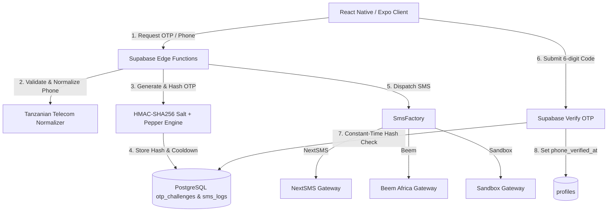

# MloHub STAGE 8: SMS & OTP Architecture Audit

**Audit Date**: September 16, 2026  
**Audited Scope**: SMS delivery gateways, OTP generation/verification, credential isolation, and phone normalization.  
**Application**: MloHub Mobile (Expo / React Native + Supabase Edge Functions + PostgreSQL)

---

## 1. Executive Summary
Prior to Stage 8, MloHub relied on a combination of in-memory simulated SMS logging and prototype gateway adapters directly referencing environment variables that risked leaking to client bundles via `EXPO_PUBLIC_` prefixes. Furthermore, vendor activation relied on a visible 4-digit temporary PIN (`1234`) displayed in the admin console rather than a carrier-delivered OTP activation flow.

This audit establishes the baseline vulnerabilities, architectural requirements, and transformation roadmap for Stage 8.

---

## 2. Inventory of Current SMS & OTP Code

| File | Purpose | Audit Finding | Priority |
|---|---|---|---|
| `services/sms/SmsProvider.ts` | SMS Provider interface & NextSMS/Beem adapters | Checked `EXPO_PUBLIC_` keys, client-side fetch calls risking credential bundling, fallback to console log | **P0 (Critical)** |
| `services/AdminOnboardingService.ts` | Vendor onboarding & OTP verification | Generates 6-digit OTP, but also generated plaintext 4-digit temporary PINs; exposes PIN in return payload | **P0 (Critical)** |
| `app/admin/index.tsx` | Admin application approval modal | Rendered `[ 1234 ]` temporary PIN in cleartext modal | **P0 (Critical)** |
| `context/AuthContext.tsx` | Authentication state & customer OTP functions | `sendCustomerOtp` and `verifyCustomerOtp` were mocked with static return `{ success: true }` | **P1 (High)** |
| `app/auth/register-customer.tsx` | Customer registration screen | Commented `// Direct Customer Registration (No SMS OTP required)`; phone verification bypassed | **P1 (High)** |
| `components/admin/SystemHealth.tsx` | Admin health status monitor | Displayed static `SIMULATED (CARRIER REGEX)` regardless of adapter configuration | **P2 (Medium)** |
| `supabase/migrations/20260908000001_...` | Core database schema | Had `otp_challenges` table with basic columns, but lacked `sms_logs` table and `phone_verified_at` timestamp | **P1 (High)** |

---

## 3. Vulnerability & Risk Matrix

### P0: Credential Leakage Risk in Client Bundle
- **Issue**: Any environment variables prefixed with `EXPO_PUBLIC_` are baked into the compiled JavaScript bundle during `npx expo export`.
- **Remediation**: Remove all `EXPO_PUBLIC_` references to SMS gateway credentials. Move all gateway credentials (`NEXTSMS_USERNAME`, `NEXTSMS_PASSWORD`, `BEEM_API_KEY`, `BEEM_SECRET_KEY`, `SMS_OTP_PEPPER`) exclusively to backend environment variables (Supabase Edge Functions / server-side runtime).

### P0: Plaintext Temporary PIN Exposure
- **Issue**: Admin onboarding generated a 4-digit PIN (defaulting to `1234` or random) and rendered it directly on screen.
- **Remediation**: Eliminate plaintext PIN display. The admin approval triggers an SMS invitation link / OTP sent directly to the vendor's verified phone. The vendor activates their account and sets their own secure password.

### P1: Unverified Customer Phone Numbers
- **Issue**: Customer registration accepted any phone string without carrier validation or OTP verification, and `profiles.is_phone_verified` was not backed by cryptographic verification.
- **Remediation**: Normalize all phone numbers to Tanzanian E.164 (`+255...`), validate network prefixes, dispatch carrier OTP, and verify via HMAC-SHA256 salted hash before setting `phone_verified_at`.

### P1: Missing SMS Delivery Audit Trail
- **Issue**: SMS dispatches lacked an immutable database log table, making carrier delivery tracking and billing reconciliation impossible.
- **Remediation**: Implement `sms_logs` PostgreSQL table and repository with statuses `QUEUED`, `SENT`, `DELIVERED`, and `FAILED`.

---

## 4. Architecture Blueprint for Stage 8

---

## 5. Next Steps
1. Create `STAGE_8_SMS_SECURITY_AUDIT.md`.
2. Secure `.env.example` with clear backend-only variable classification.
3. Build normalizer, gateway adapters, and OTP security engine.
4. Apply database migration and Edge Functions.
5. Harden client flows and update SystemHealth.
6. Verify with 100% test coverage.
