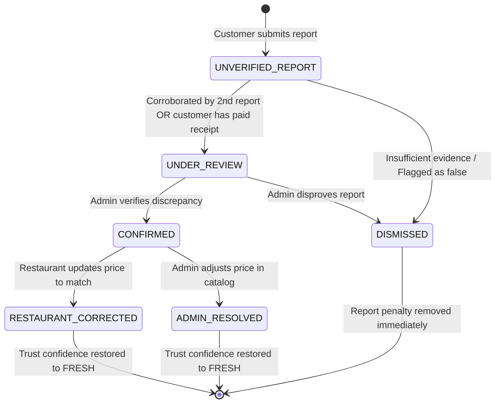

# MLOHUB EXPLAINABLE TRUST MODEL

## 1. Core Philosophy
Trust on MloHub is **multi-dimensional, deterministic, and explainable**.
It rejects single-rating reductionism (e.g. collapsing restaurant quality into a 4.2-star rating) and prohibits opaque artificial scores.

---

## 2. The 8 Trust Dimensions

| Dimension | Scope | Evaluation Basis | Customer Label |
|---|---|---|---|
| **1. MENU_FRESHNESS** | Dish & Restaurant | Time elapsed since last physical audit or manual update | "Verified Today" (<= 24h) / "Confirmed Recently" (<= 72h) / "Stale" (> 7d) |
| **2. PRICE_CONFIDENCE** | Dish | Freshness decay combined with active customer discrepancy reports | "Verified Price" / "Price Under Review" / "Disputed Price" |
| **3. AVAILABILITY_CONFIDENCE** | Dish | Daily stock toggle and real-time kitchen cancellation reasons | "Available" / "Low Stock" / "Sold Out" |
| **4. HOURS_CONFIDENCE** | Restaurant | Opening hours adherence vs order cancellations due to "Closed" | "Open Now (Verified)" / "Hours Tentative" |
| **5. LOCATION_CONFIDENCE** | Restaurant Branch | Geocoding accuracy and customer directions completion | "Exact Pin" / "Approximate Ward" |
| **6. FULFILLMENT_RELIABILITY** | Restaurant | Bayesian Laplace smoothed completion rate over historical orders | "96% Reliability (120 orders)" / "New Partner" |
| **7. CUSTOMER_REPORT_HEALTH** | Restaurant | Active, corroborated discrepancy reports under review | "Clean Record" / "1 Discrepancy Under Review" / "Multiple Disputed Prices" |
| **8. VERIFICATION_STATUS** | Business Entity | Government registration (BRELA, TIN, Business License) | "BRELA & TIN Verified Partner" / "Unverified Business Profile" |

---

## 3. Mathematical Foundations

### 3.1 Freshness & Confidence Step Decay
Price confidence $C(t)$ begins at $1.0$ upon explicit restaurant or admin verification and decays as a function of age $\Delta t$:

$$C(\Delta t) =
\begin{cases}
1.00 & \text{if } \Delta t \le 24\text{ hours (FRESH)} \\
0.85 & \text{if } 24\text{ hours} < \Delta t \le 72\text{ hours (RECENT)} \\
0.60 & \text{if } 72\text{ hours} < \Delta t \le 7\text{ days (AGING)} \\
0.30 & \text{if } \Delta t > 7\text{ days (STALE)} \\
0.00 & \text{if unverified (UNKNOWN)}
\end{cases}$$

### 3.2 Impact of Discrepancy Reports
Active discrepancy reports apply a penalty multiplier:

$$C_{\text{final}} = \max(0.0, C(\Delta t) \times (1.0 - P_{\text{report}}))$$

Where $P_{\text{report}}$ is:
- $0.15$ for a single `UNVERIFIED_REPORT`
- $0.35$ for `UNDER_REVIEW` (corroborated or paid-order customer)
- $0.70$ for `CONFIRMED` price error.

### 3.3 Bayesian Fulfillment Reliability (Small Sample Protection)
To prevent a new restaurant with $2/2$ completed orders from outranking an established restaurant with $4,900 / 5,000$ completed orders, MloHub uses Bayesian Laplace smoothing:

$$\text{Reliability} = \frac{\text{Completed Orders} + \alpha}{\text{Total Assigned Orders} + C}$$

Where the platform prior uses:
- $C = 10$ pseudo-orders
- $\alpha = 8.5$ pseudo-successes (85% baseline platform expectation).

If $\text{Total Assigned Orders} < 5$, the restaurant is flagged as `NEW_RESTAURANT` / `INSUFFICIENT_DATA` with the explicit explanation:
*"New partner — fewer than 5 orders fulfilled"*.

---

## 4. Discrepancy Report Lifecycle & Trust Recovery

---

## 5. Anti-Sabotage Safeguards
1. **Rate Limiting**: Diners are restricted to 1 report per item per 24 hours and a maximum of 3 discrepancy reports per day platform-wide.
2. **Paid-Order Bonus**: Reports from diners with a completed paid order for that dish carry $3\times$ higher evidence weight.
3. **Instant Recovery**: When a kitchen updates their menu price or confirms accuracy, their trust score immediately recalculates to `FRESH`.
